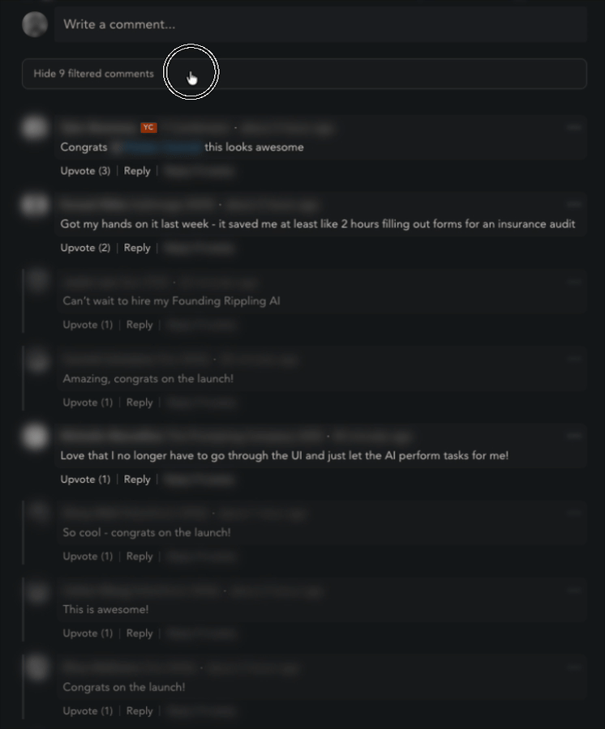

# BF Filter

Userscript that filters low-value comments on Bookface. Hides "congrats!", "+1", "W", emoji-only replies, and other fluff so you can focus on substantive discussion.

## Install

1. Install [Violentmonkey](https://violentmonkey.github.io/) (Firefox/Chrome/Edge) or [Tampermonkey](https://www.tampermonkey.net/)
2. [Click here to install the script](https://raw.githubusercontent.com/bharadswami/bf-filter-userscript/main/bf-filter.user.js)
3. Visit any Bookface post

## How it works

Three filter layers run in order:

| Filter          | Default             | What it catches                                    |
| --------------- | ------------------- | -------------------------------------------------- |
| **Length**      | < 50 chars          | Short low-effort comments                          |
| **Keyword**     | ~80 phrases + regex | "congrats", "lol", "+1", emoji-only, etc.          |
| **AI** (opt-in) | Off                 | Remaining low-value comments via Gemini Flash Lite |

- YC staff comments are **never** filtered
- Thread context is preserved -- a low-value comment stays visible if it has substantive replies
- Filtered comments can be toggled visible via the summary bar

## AI filter setup

The AI filter is optional and off by default. To enable:

1. Get a [Gemini API key](https://aistudio.google.com/apikey) (free tier available)
2. Right-click the Violentmonkey/Tampermonkey icon > BF Filter > **Set Gemini API key**
3. Right-click > BF Filter > **Toggle AI filter**

AI results are cached in localStorage so repeat visits don't make redundant API calls.

## Settings

All settings are available via the userscript manager's menu (right-click the extension icon):

- Toggle BF Filter on/off
- Toggle keyword filter
- Toggle length filter
- Toggle AI filter
- Set min character threshold
- Set Gemini API key
